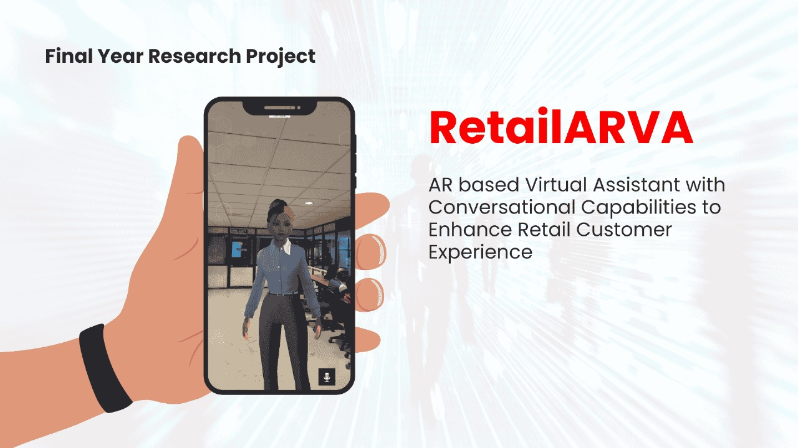

# 📦 RetailARVA
> AR based Virtual Assistant with Conversational Capabilities to Enhance Retail Customer Experience



---
## 📑 Table of Contents

- [About](#about)

---

## 📖 About

RetailARVA combined Augmented Reality and LLMs to bring life to a virtual assistant with conversational capabilities to assist customers in brick and mortar stores with intent to improve the customer experience

---

## ✨ Features

- ✅ Humanlike conversational capabilities powered by LLM pipelines
- ✅ Augmented reality based virtual assistant with lip syncing and interaction through visual cues
- ✅ Interaction with assistant through voice input and output
---

## 🛠️ Installation

Clone the repo:

```bash
git clone https://github.com/your-username/project-name.git
cd project-name
```